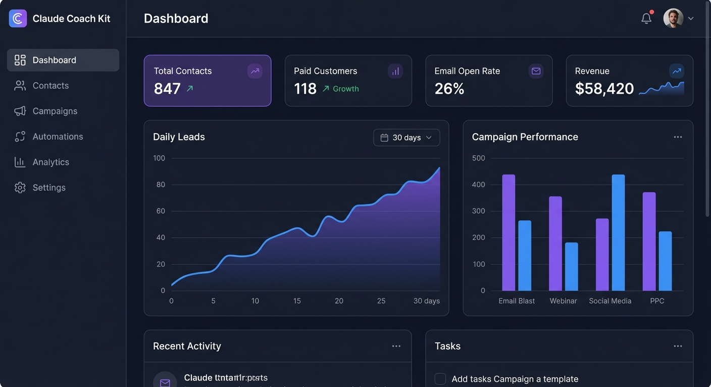
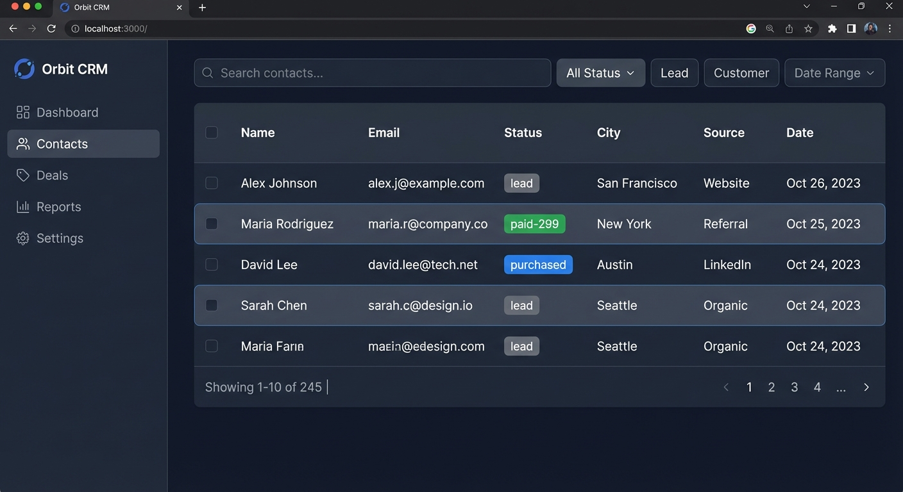
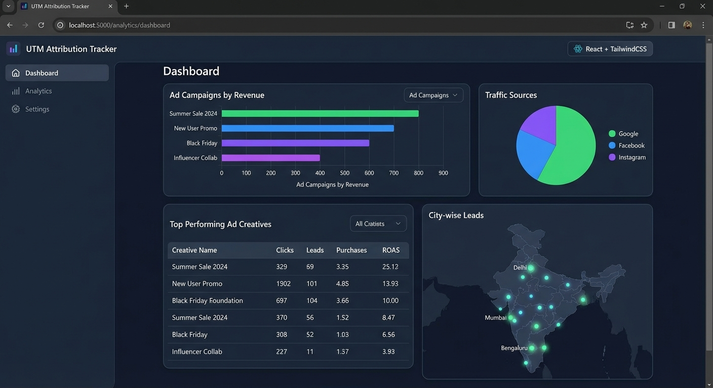

<](./LICENSE)
[](https://supabase.com)
[](https://claude.ai)
[](https://react.dev)
[](https://typescriptlang.org)
[](https://tailwindcss.com)

<br />

> **Stop paying $200+/month for marketing tools.**
> CoachKit gives you everything you need — email sequences, payment tracking, UTM attribution, lead management, and analytics — all self-hosted, all free.

<br />

[Quick Start](#-quick-start) · [Features](#-features) · [Architecture](#-architecture) · [Contributing](#-contributing) · [License](#-license)

</div>

---

## 📸 Screenshots

<details>
<summary>Click to expand screenshots</summary>

| Dashboard | Contacts | Attribution |
|-----------|----------|-------------|
|  |  |  |

| Email Sequences | Campaign Editor | Pipeline |
|-----------------|-----------------|----------|
|  |  |  |

</details>

---

## ✨ Features

### 📧 Email Marketing
- **Email Sequences** — Multi-step drip campaigns with delays, conditions, and A/B testing
- **Campaign Editor** — Rich HTML email editor with templates and personalization tokens
- **Email Reports** — Track opens, clicks, bounces, and unsubscribes in real-time
- **Template Library** — Pre-built email templates you can customize

### 💰 Payment Tracking
- **Razorpay Integration** — Automatic payment verification via webhooks
- **Multi-tier Tracking** — Track entry-level payments AND high-ticket conversions
- **Revenue Analytics** — Revenue breakdowns by campaign, source, and time period
- **Customer Journey** — See the full path: Lead → First Payment → Upsell → High Ticket

### 📊 Analytics & Attribution
- **UTM Attribution** — Track which ads, campaigns, and creatives drive revenue
- **Conversion Funnels** — Visual funnel analysis from lead to paid customer
- **Cohort Analysis** — Weekly cohort breakdowns showing conversion velocity
- **Campaign ROI** — Know exactly which campaigns generate what revenue

### 👥 Lead Management
- **Contact CRM** — Full contact management with custom fields, tags, and notes
- **Pipeline View** — Kanban-style pipeline for tracking deal stages
- **Smart Segments** — Dynamic segments based on behavior, tags, and payment status
- **Bulk Actions** — Tag, export, and enroll contacts in sequences in bulk
- **Import/Export** — CSV import with deduplication and field mapping

### 🔗 Integrations
- **Google Sheets Sync** — Two-way sync with your existing spreadsheets
- **Razorpay Webhooks** — Real-time payment event processing
- **WhatsApp** — Send and track WhatsApp messages (via API)
- **Meta Ads** — View and analyze your Facebook/Instagram ad performance
- **Resend / SMTP** — Flexible email delivery (Resend, Postmark, or any SMTP)

### 🎨 UI/UX
- **Dark & Light Mode** — Beautiful themes with smooth transitions
- **Mobile Responsive** — Full functionality on phones and tablets
- **Command Palette** — `⌘K` quick navigation to any page or contact
- **Real-time Updates** — Live data via Supabase Realtime subscriptions
- **Animated Dashboard** — Smooth animations with Framer Motion

---

## 🏗 Architecture

```
┌──────────────────────────────────────────────────────────┐
│                     FRONTEND (React)                      │
│                                                           │
│  ┌─────────┐ ┌──────────┐ ┌───────────┐ ┌────────────┐  │
│  │Dashboard │ │ Contacts │ │ Sequences │ │ Analytics  │  │
│  └────┬─────┘ └────┬─────┘ └─────┬─────┘ └─────┬──────┘  │
│       │            │             │              │          │
│  ┌────┴────────────┴─────────────┴──────────────┴──────┐  │
│  │              Supabase Client (JS SDK)                │  │
│  └─────────────────────┬───────────────────────────────┘  │
└────────────────────────┼──────────────────────────────────┘
                         │
                    ┌────┴─────┐
                    │ Supabase │
                    │   API    │
                    └────┬─────┘
                         │
        ┌────────────────┼────────────────────┐
        │                │                    │
   ┌────┴────┐    ┌──────┴──────┐    ┌───────┴───────┐
   │PostgreSQL│    │Edge Functions│    │  Realtime     │
   │  (DB)   │    │             │    │  (WebSocket)  │
   └─────────┘    │• email-engine│    └───────────────┘
                  │• razorpay-wh │
                  │• track-visit │
                  │• trigger-sync│
                  └──────────────┘
                         │
        ┌────────────────┼──────────────────┐
        │                │                  │
   ┌────┴────┐    ┌──────┴──────┐    ┌─────┴──────┐
   │ Razorpay│    │ Resend/SMTP │    │ Google     │
   │Webhooks │    │ (Email)     │    │ Sheets API │
   └─────────┘    └─────────────┘    └────────────┘
```

---

## 🛠 Tech Stack

| Category | Technology |
|----------|-----------|
| **Frontend** | React 19, TypeScript, Vite |
| **Styling** | TailwindCSS 4, Framer Motion |
| **Backend** | Supabase (PostgreSQL + Auth + Edge Functions) |
| **Charts** | Recharts |
| **Icons** | Lucide React |
| **Email** | Resend / SMTP (configurable) |
| **Payments** | Razorpay (webhooks) |
| **State** | TanStack React Query |
| **Rich Text** | TipTap |

---

## 🚀 Quick Start

### Prerequisites

- Node.js 18+
- A [Supabase](https://supabase.com) project (free tier works)
- A [Resend](https://resend.com) API key (or any SMTP provider)

### 1. Clone & Install

```bash
git clone https://github.com/YOUR_USERNAME/coachkit.git
cd coachkit
npm install
```

### 2. Configure Environment

```bash
cp .env.example .env
```

Edit `.env` with your credentials:

```env
VITE_SUPABASE_URL=https://your-project.supabase.co
VITE_SUPABASE_ANON_KEY=your-anon-key
VITE_APP_NAME=CoachKit
```

### 3. Set Up Database

Run the SQL migration in your Supabase SQL editor:

```bash
# Apply the schema
cat supabase/migrations/001_initial_schema.sql | pbcopy
# Paste into Supabase SQL Editor and run
```

### 4. Deploy Edge Functions

```bash
supabase functions deploy email-engine
supabase functions deploy razorpay-webhook
supabase functions deploy track-visitor
supabase functions deploy trigger-sync
```

### 5. Start Development

```bash
npm run dev
```

Visit `http://localhost:5173` and sign in with your Supabase credentials.

### 6. (Optional) Set Up Sync Scripts

For Google Sheets sync and payment tracking:

```bash
cd scripts
cp .env.example .env
# Configure your sync credentials
npm install
node sync-api.js  # Starts sync API on port 3848
```

---

## 📁 Project Structure

```
coachkit/
├── src/
│   ├── pages/           # Route pages (Dashboard, Contacts, etc.)
│   ├── components/      # Shared UI components
│   ├── contexts/        # React context providers
│   ├── lib/             # Utilities and Supabase client
│   └── types/           # TypeScript type definitions
├── supabase/
│   ├── functions/       # Edge functions (email, webhooks, etc.)
│   └── migrations/      # SQL schema migrations
├── scripts/             # Sync scripts (Google Sheets, payments)
├── docs/                # Documentation and screenshots
└── public/              # Static assets
```

---

## 🗄 Database Schema

CoachKit uses the following main tables in Supabase:

| Table | Purpose |
|-------|---------|
| `automation_contacts` | All leads and customers |
| `automation_sequences` | Email sequence definitions |
| `automation_sequence_steps` | Individual steps in a sequence |
| `automation_sequence_enrollments` | Contact-sequence enrollment tracking |
| `automation_email_log` | Email delivery and engagement tracking |
| `automation_campaigns` | One-off email campaigns |
| `automation_tags` | Contact tags/labels |
| `automation_webhook_log` | Incoming webhook event log |
| `automation_workflows` | Automation workflow definitions |
| `profiles` | User profiles and roles |

---

## ⚙️ Configuration

### Email Provider

CoachKit supports multiple email providers. Configure in your Supabase Edge Function secrets:

```bash
# Resend (recommended)
supabase secrets set RESEND_API_KEY=re_xxx

# Or SMTP
supabase secrets set SMTP_HOST=smtp.example.com
supabase secrets set SMTP_PORT=587
supabase secrets set SMTP_USER=user@example.com
supabase secrets set SMTP_PASS=your-password
```

### Payment Provider

Currently supports Razorpay. Configure the webhook URL in your Razorpay dashboard:

```
https://your-project.supabase.co/functions/v1/razorpay-webhook
```

### UTM Tracking

Add the tracking script to your landing pages:

```html
<script src="https://your-project.supabase.co/functions/v1/track-visitor"></script>
```

---

## 🤝 Contributing

We welcome contributions! See [CONTRIBUTING.md](./CONTRIBUTING.md) for guidelines.

### Development Workflow

1. Fork the repository
2. Create a feature branch: `git checkout -b feature/amazing-feature`
3. Make your changes
4. Run linting: `npm run lint`
5. Commit: `git commit -m 'feat: add amazing feature'`
6. Push: `git push origin feature/amazing-feature`
7. Open a Pull Request

### Areas We Need Help

- 🌍 **Internationalization** — Support for multiple languages/currencies
- 📱 **Mobile App** — React Native companion app
- 🔌 **Integrations** — Stripe, Mailchimp, ConvertKit connectors
- 📖 **Documentation** — Tutorials, guides, and API docs
- 🧪 **Tests** — Unit and integration test coverage

---

## 📄 License

This project is licensed under the MIT License — see the [LICENSE](./LICENSE) file for details.

---

## 🙏 Acknowledgements

- [Supabase](https://supabase.com) — Backend infrastructure
- [Anthropic Claude](https://claude.ai) — AI pair programming
- [Lucide](https://lucide.dev) — Beautiful icons
- [TailwindCSS](https://tailwindcss.com) — Utility-first CSS
- [Recharts](https://recharts.org) — React charting library

---

<div align="center">

**Made with ❤️ for the coaching community**

[⬆ Back to top](#-coachkit--open-source-marketing-automation)

</div>
]]>